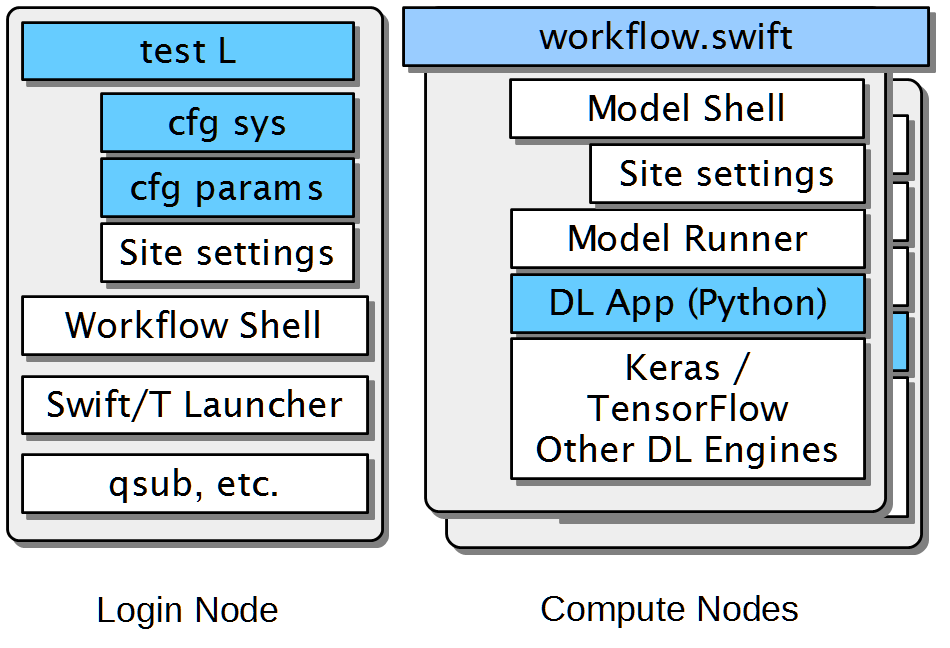

:toc:

= Overview of CANDLE/Supervisor

CANDLE/Supervisor is a collection of workflows and supporting scripts to run ensembles of deep learning models on exascale computers.  These include flat parameter sweeps, hyperparameter optimization, and other analysis workflows.

== Architecture

The CANDLE/Supervisor architecture is depicted in the figure below:

In the image, blue components are those to be heavily edited by users, where the white components will require little or no changes.

== Invocation

Supervisor executions starts with a Bash test script (shown as "test L"); these are intended to be rapidly copied, changed, and executed.  Supervisor workflow examples include cases named "test-1" or "test-nightly" that are the simplest cases to run.  These test scripts can override settings from the cfg files for quick tests.  The command-line arguments to the test script include the site name and the experiment directory name to use for the run, these can be extended.  The test script also specifies `MODEL_RETURN`, which is the value to be returned by the model run, typically `val_loss`, etc.

The test script may be invoked directly or via the link:bin[`supervisor` tool].

== Settings files

The cfg files are Bash scripts.  Conventionally, they are split into settings that configure the run with respect to the computing system ("sys") or the numerical parameters ("prm") of the run.  This allows settings to be reused across tests.  These can also be easily duplicated and modified.  cfg-sys settings include `QUEUE`, `WALLTIME`, `PROCS`, and other basic compute job settings.  cfg-prm settings are typically related to the optimizer for HPO or other numerical settings.  These settings can also be merged into a single file.

The site settings are Bash scripts provided by Candle but can be modified or duplicated for new machines.  These refer to `env-SITE`, `sched-SITE`, and `langs-app-SITE` files in `Supervisor/workflows/common/sh` .  `env-SITE` configures the login node environment, `sched-SITE` configures the use of the system scheduler, and `langs-app` configures the environment to be used on the compute node (if Swift/T app functions are used).  `env-SITE` typically sets up `PATH`, `PYTHONPATH`, etc., for Python, Swift/T, etc.  `sched-SITE` sets the Swift/T `MACHINE` variable so that Swift/T uses the right scheduler, and any other site-specific scheduler settings.  `langs-app-SITES` typically sets `PATH`, `PYTHONPATH`, etc., for the compute node, which is commonly different from the settings for the login node.

== The workflow layer

The workflow shell script (`workflow.sh`) is a Bash script that loads the previously mentioned settings passes them to Swift/T.  Some settings are passed as environment variables, some as command-line arguments, and so on.  Other workflow-specific configuration may also be done here (setting up restarts, etc.).

The Swift/T launcher is part of Swift/T.  This includes the Swift/T scheduler templates that are filtered and launched by Swift/T.  See the http://swift-lang.github.io/swift-t/sites.html[Swift/T Sites Guide] for details.

Finally, `qsub` or equivalent is run by the Swift/T launcher scripts.

== Execution on the compute nodes

Swift/T runs as single multi-node MPI job, shown as workflow.swift .  Swift/T logic encoded in workflow.swift proceeds until a Swift/T app function or python() launches execution.  In Supervisor, this conventionally happens inside the function called obj(), which launches a CANDLE-compliant model run.  obj() is the CANDLE objective function, in the sense of optimization or whatever else the workflow is doing. obj() has multiple implementations for external forked execution (obj_app.swift), in-memory Python execution (obj_py.swift), and a debugging non-execution mode that reports the hyperparameters (obj_echo.swift).  This is controlled by environment variable SWIFT_IMPL and is actuated by the ``swift-t -i`` argument, which imports the selected Swift/T module into the workflow.

=== Execution via the Model Shell

External forked execution in Supervisor starts with a call to the Model Shell (`model.sh`) which redirects output to `model.log`, loads the `langs-app-SITE` settings described above, and runs the Model Runner in Python.  The Model Shell sets up PYTHONPATH and prepends APP_PYTHONPATH - this is because the Python used by Swift/T may be different from the Python the user desires to use on the compute nodes.  PYTHONPATH will affect Swift/T but APP_PYTHONPATH will not.  APP_PYTHONPATH can contain any entries needed to run the user model, including entries that will break Swift/T, such as libraries from an entirely different Python environment.

=== Execution via the Model Runner

In-memory execution skips straight to the Model Runner without fork or the ability to perform shell configuration.  APP_PYTHONPATH is not used here, so the PYTHONPATH must be correct for both Swift/T and the user model, since they are sharing the same Python instance.

The Model Runner (`model_runner.py`) sets up and runs the model.  It imports the required Python modules, processes the hyperparameters (formatted as JSON), and performs other optional configuration, and then runs the model via CANDLE-compliant interfaces.  The return value is specified by the obj_return value.

=== Other Python models

To run an external model, that is, not one of the CANDLE Benchmarks, the user should set  environment variable MODEL_NAME and PYTHONPATH and/or APP_PYTHONPATH.  The Model Runner will attempt to load the model package via the Python command ``import MODEL_NAME_baseline_FRAMEWORK`` where MODEL_NAME and FRAMEWORK are set in the environment.  It will then invoke the CANDLE-compliant API on that package.

=== Containerized models via IMPROVE

Containerized models are specified with `CANDLE_MODEL_TYPE=SINGULARITY`.  They are executed by `model.sh`, which simply runs the command

----
singularity exec SIF train.sh
----

instead of invoking `python` directly.  Output is gathered from stdout as in the normal Python case.

Examples of IMPROVE Singularity container definitions may be found
https://github.com/JDACS4C-IMPROVE/Singularity/tree/develop/definitions[here].

== How to call your model

These environment variable settings may be placed in any Supervisor configuration file.

=== Models in plain Python

Assuming your model is named MODEL:

. Wrap your model in the CANDLE-compliant API
. Name your module `MODEL_baseline_keras2.py`
. Set `PYTHONPATH` to the location of your module
. Set `export MODEL_NAME=MODEL`

See https://github.com/ECP-CANDLE/Tests/tree/main/sv-tool/user-case-1[this example].

=== Models in Singularity containers

. Package your container according to IMPROVE guidelines
. `export MODEL_NAME=/path/to/model.sif`
. `export CANDLE_MODEL_TYPE=SINGULARITY`

See https://github.com/ECP-CANDLE/Tests/tree/main/sv-tool/user-case-2[this example].

== Installation

=== Local Linux or Mac/ARM system:

. Install Python 3.9
. Install https://github.com/ECP-CANDLE/candle_lib[`candle_lib`]
. Install Swift/T from Anaconda:
+
----
conda install -c conda-forge -c swift-t swift-t
----
+
. Check out Supervisor
.. Switch to branch `develop`
.. Add `Supervisor/bin` to `PATH`
. Run `supervisor`

=== Compute cluster or supercomputer

Install as for local system but build Swift/T from source.
